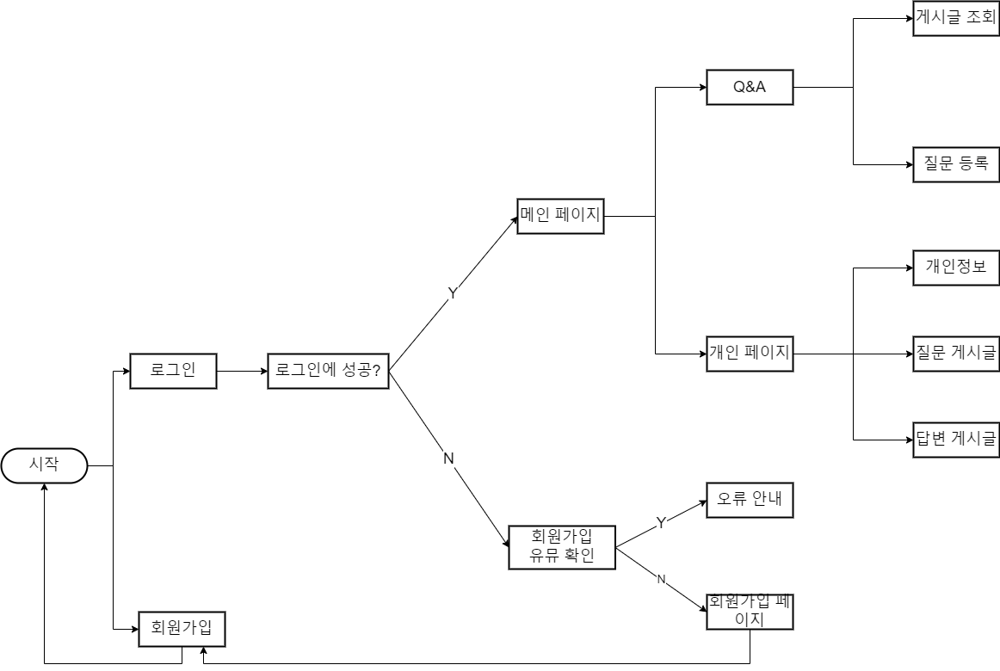
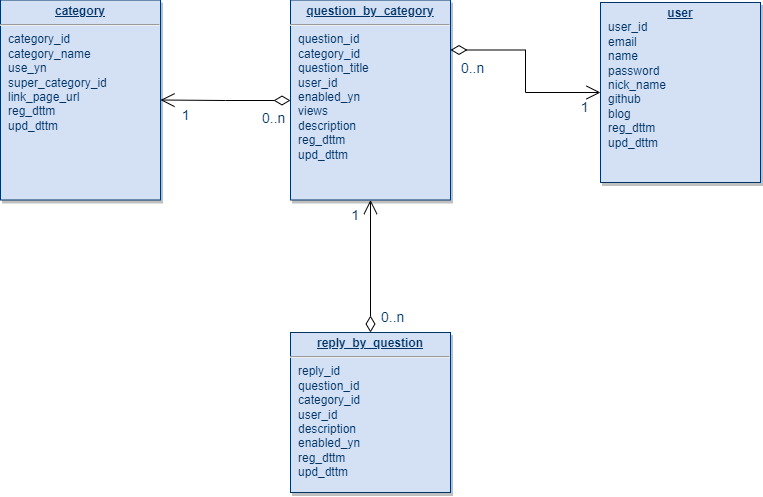
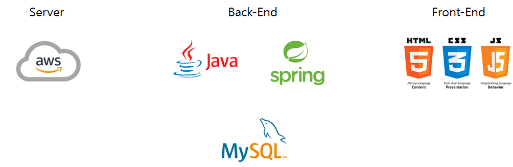

# 🔊 개발자 커뮤니티 사이트 프로젝트

> This is a developer community site project using Java and Spring. 
> This is my first side project. 
> If there are any shortcomings, feedback is always welcome.

 

## 구현 기능

* [ ] 회원가입
  * [ ] github, gmail 연결
  * [X] 개인정보를 통한 가입
    * e-mail → id
    * passowrd
    * 닉네임
    * 이름

* [ ] Q&A 게시판
  * [X] 카테고리 구성(조회)
    * 전체
    * Backend
    * Frontend
    * Server
    * Network
    * Data Enginnering
    * Algorithm
    * 기타

  * [ ] 검색
    * [ ] 키워드 검색
      * 상세조회 기능 추가(언어, 카테고리 필터)
  
  * [ ] 질문
    * [X] 질문 등록하기
    * [ ] 검색에 따른 질문 목록 보여주기
    * [ ] 질문 상세보기
  
  * [ ] 답변
    * [ ] 질문에 대한 답글 달기

* [ ] 개인 페이지
  * [ ] 프로필
    * 프로플 사진
    * 닉네임
    * 간단한 자기소개
    * github link
    * blog link

  * [ ] 등록한 질문 리스트
  * [ ] 등록한 답글 리스트

   

## FlowChart

 

## DB - ERD

 

## 전체 시스템 구성도

 

## 데이터 플로우
 

## 백엔드 개발
 

## 프론트엔드 개발
 

## 향후 추가 기능
